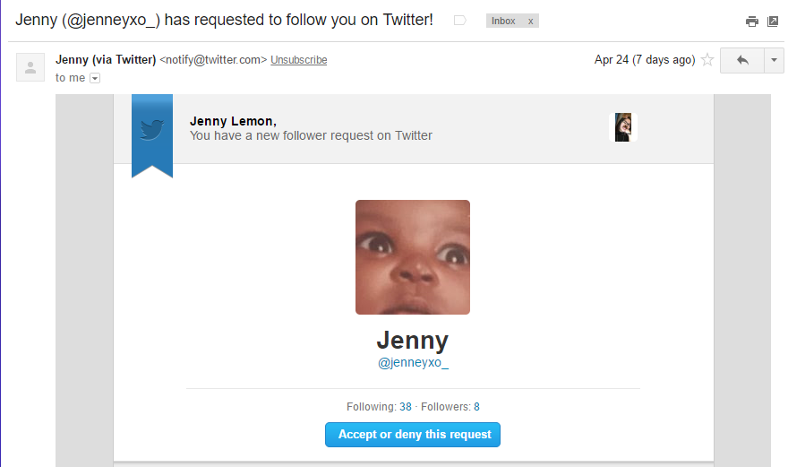

# Requested Follower

There hasn't been anything that I could learn from all the Github tutorials that I have/found. I looked over another Github page and what happened next was minor, but miraculous to me.

## Learning

One simple line. That was all it took to have a bot to request a user. I typed one line of code after the consumer key, consumer secret, token key, and token secret.

``
client.follow("gem") #screen name
``

After replacing the word inside the quotes with a Twitter username and I used my my personal to test out if it really worked or not. When I received an email saying that "jenneyxo_" (my scrap account) had requested to follow my personal, I was literally so excited, because I DID SOMETHING. It was a small thing that I learned but I have never been so proud and exhilarated to know how to get my Twitter bot to request a user.

Receiving this email with this marvelous picture showed me that I actually did sent a follow request to my personal account.

## Takeaways
1. I still struggle with learning how to making a functioning Twitterbot, because there is not much on the two Github tutorials that I use alone. So I googled some Youtube videos, yes I am desperate for any kind of help.
2. I decided to bring my rubber ducky *eye emoji looking upwards*. Talking to Sargent Eskimoski really helped with my frustration as I continued to scream at him :( but I will definitely recommend speaking to your friend or something inanimate. 
3. When you're working on your project at home, be sure to reread and do some yoga~ Don't stress yourself out and always check for minor typing mistakes. When I have a big chunk of code, I usually copy one part of the code, go over which part has a mistake, if not, then I repeat with the other blocks of code.

Here is my [Twitter](https://twitter.com/jenneyxo_) page

[Previous](entry1-intro.md) | [Next](entry3-new-methods.md)

[Table of Contents](../README.md)