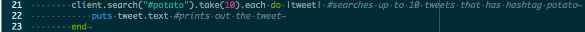

# In a Search for Words

Next up on this Github tutorial was how to search key words and sending a retweet back to that specific tweet. I don't know what's harder, searching for words or searching for a life. I thought when Mr. Mueller is teaching is difficult but learning on your own is a whole different level. 

## Fixing My Mistake(s)

Again, according the previous and past blog entries, the littlest mistakes are mistakes that you least expect because it just doesn't seem wrong! Am I right? I know I'm right because I'm going through that phase still. When I make 

## Takeaways
1. I actually used Google and it actually was helpful for once. I didn't understand the purpose of the client.sample and client.filter, etc. I tried and tried and tried (and cried) over the an issue so small that when I realized what was wrong, I thank Google. 
2. My partner (Enrique, props to you, buddy!) looked over my shoulder and asked me a bunch of questions that led me thinking what the problem/solution was. I'm always afraid to speak because when I do, I don't even understand what I'm saying. So, I write or draw it out to the person that I'm explaining to. Trust me, life just got better.

Here is my [Twitter](https://twitter.com/jenneyxo_) page

[Previous](entry1-intro.md) | [Next](entry3-new-methods.md)

[Table of Contents](../README.md)